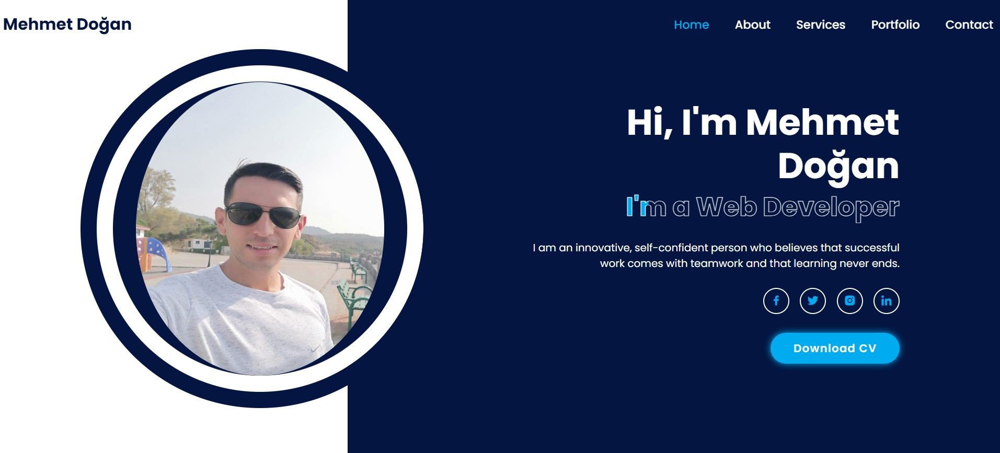

# Mehmet Doğan Web Page

Welcome to the Mehmet Doğan Web Page project. This page showcases Mehmet Doğan's portfolio and provides information about his skills and services.

## Technologies Used

- HTML5
- CSS3
- Boxicons (for icons)
- Google Fonts (Poppins)

## Live Demo

You can view the live demo of the Mehmet Doğan Web Page [here](https://portfolio-mehmet-alpha.vercel.app/).

## Description

This web page is designed to showcase Mehmet Doğan's profile as a web developer. It includes a navigation bar, a hero section with an image and content, social media links, and a call-to-action button to download his CV.

## Usage

- Explore different sections using the navigation bar.
- Learn about Mehmet Doğan's skills and services.
- Connect with him through social media links.
- Download his CV for more information.

## Screenshots

## Installation

To run the Mehmet Doğan Web Page locally, follow these steps:

1. Clone this repository to your local machine.
2. Open the `index.html` file in your web browser.

# GitHub Repository

You can follow the development of this project on GitHub. Feel free to star the repository to show your support.

